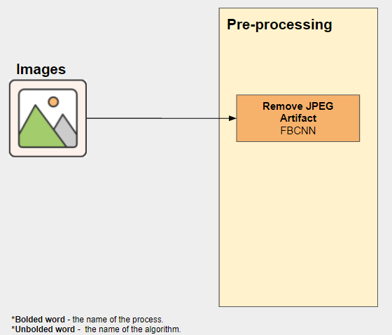
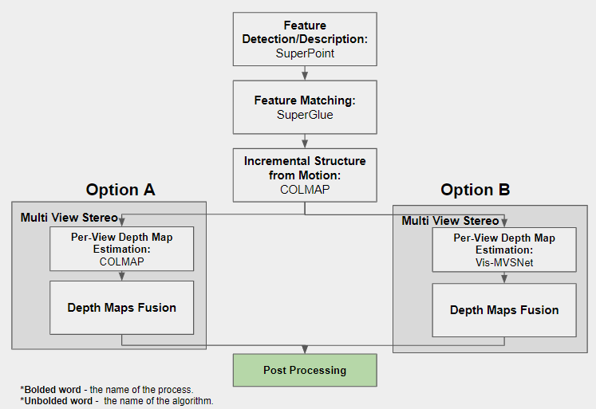
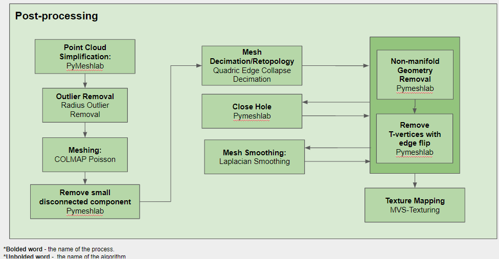
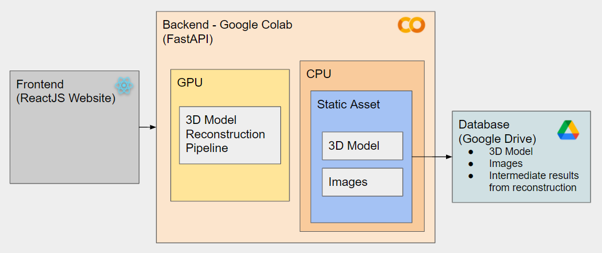

# 3D Model Reconstruction
## Pre-processing

In this phase, images will be pre-processed by removing the JPEG artifact from the image file as images taken from a phone camera are JPEG file. JPEG artifact is a result from the way data is compressed by the JPEG algorithm. To achieve this, FBCNN, a state of the art convolutional neural network is used. 

<br clear="left"/>

## Main Algorithm

After that, features are detected and matched from the preprocessed images with the use of deep learning, SuperPoint and SuperGlue. 
Next, incremental structure from motion algorithm is performed with the COLMAP implementation. 
In the next step, multi view stereo algorithm is conducted by estimating the depth map of each images and fuse together. 
As you can see, there are 2 options of Multi view stereo algorithm to choose from. 
Option A is a non-deep learning method which uses the COLMAP implementation whereas option B is a deep learning method which uses Vis-MVSNet. There is a tradeoff between completeness and speed of execution between these 2 options. 
Option A offers a more complete and accurate point cloud whereas option B offers 3 times faster execution of the algorithm. If the user want to have a 3D model in a short amount of time under certain scenario, user can choose option B but with a tradeoff of the quality of the 3D model.

<br clear="left"/>

## Post-processing

Once the point cloud is generated, the point cloud is simplified to reduce the number of points using the pyMeshLab implementation. 
After that, outliers are removed from the simplified point cloud using radius outlier removal algorithm. 
Next, Poisson Surface Reconstruction is used to generate mesh from the point cloud. 
Later, small disconnected mesh will be removed. 
Then, quadric edge collapse decimation is used to reduce the number of faces on the mesh. 
After that, non-manifold geometry and T-vertices are removed from the mesh. 
Afterwards, some of the small hole on the surface of the mesh is closed then again non-manifold geometry and T-vertices are removed. 
Later, the mesh is smoothed with laplacian smoothing and again for the last time, non-manifold geometry and t-vertices are removed. 
Finally, the last process will be texture mapping which gives the mesh a realistic texture-look.  

<br clear="left"/>

# System Architecture

On the frontend, it is a website built using ReactJS while on the backend, it uses FastAPI to create an API run on the free Google Colab resources such as GPU and CPU. 
GPU is used on the execution of the 3D Model Reconstruction Pipeline and CPU is used to host the static asset such as 3D model and images. 
The database that the system will be using is Google Drive. Google drive will be tasked to store the static assets and other intermediate result from the reconstruction.

<br clear="left"/>

# Folder Structure
`notebook` 
- 3D_Model_Reconstruction_Pipeline.ipynb
```This is where all the algorithms code are placed```
- Backend_Util.ipynb
```This is where the utils function related to the interaction betweeen frontend and backend code are placed such as uploading images to the cloud```
